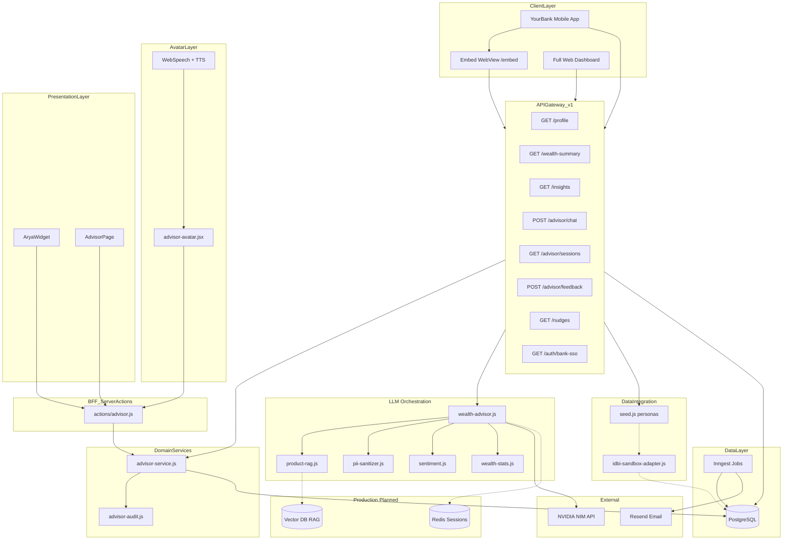

# Architecture & Data Flow

## Data flow summary

1. User opens wealth module from bank app (SSO-authenticated session)
2. Frontend calls `/api/v1/wealth-summary` for unified financial snapshot
3. Insights and chat requests hit `wealth-advisor.js` orchestration layer
4. PII is stripped before prompts reach NVIDIA NIM
5. Approved products injected via lightweight RAG (`bank-products.json`)
6. Responses rendered in avatar chat UI (widget or full page) with action widgets and feedback
7. Chat sessions, audit events, and feedback stored in PostgreSQL for bank CRM traceability
8. Background jobs (Inngest) handle recurring transactions, budget alerts, monthly emails

## Current vs planned

| Component | Hackathon MVP | Production |
|-----------|---------------|------------|
| Session | Clerk auth + DB chat sessions | Bank SSO + Redis |
| Chat history | Per-session threads in PostgreSQL | CRM integration |
| Feedback | Thumbs + audit log | Model fine-tuning pipeline |
| Product RAG | JSON keyword match | Pinecone vector search |
| Nudges | In-app toasts | Push notifications |
| Database | PostgreSQL | PostgreSQL + read replicas |
